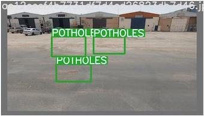
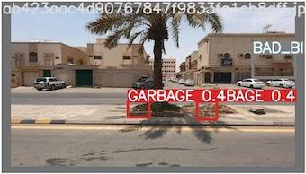

# AICAS_KSU Team: Smartathon Visual Pollution Detection

## Dataset

The dataset is provided by the [Smartathon](https://smartathon.hackerearth.com). It consists of 9966 images with different visual pollution types: GRAFFITI, FADED SIGNAGE, POTHOLES, GARBAGE, CONSTRUCTION ROAD, BROKEN_SIGNAGE, BAD STREETLIGHT, BAD BILLBOARD, SAND ON ROAD, CLUTTER_SIDEWALK, UNKEPT_FACADE.

## Demo
- The model is provided as an integrated [Huggingface Space 🤗](https://huggingface.co/spaces/LailaMB/visual_pollution_detection) web deme 
- The model is provided as a colab notebook 

## How to test
1. Clone the Visual_Pollution_Detection repository.

<code>git clone https://github.com/LailaMB/Visual_Pollution_Detection</code>

<code>cd Visual_Pollution_Detection</code>

2. Create a folder in the project and add your images into it. 

3. Replace the test folder path in <code>Visual_Pollution_Detection/data/pollution_dataset/visionpollution.yaml</code> file with the path of your folder.

4. Download the model weights from [Best_152_Focal.pt](https://drive.google.com/file/d/1mTiiVm5OCMyAlYF0Q5tf43wxugrTZ7HP/view?usp=share_link)

4. Run the following command.

<code>python test.py --data Visual_Pollution_Detection/data/pollution_dataset/visionpollution.yaml --weights "PATH_TO_THE_MODEL_WEIGHTS" --task test --img-size 800 --save-txt --batch-size 1</code>

## Inference
<code>python detect.py --weights "PATH_TO_THE_MODEL_WEIGHTS" --conf 0.3 --img-size 960 --source "PATH_TO_IMAGE" </code>

## AICAS_KSU Team

Dr.Hebah ElGibreen, Prof. Yakoub Bazi, Dr. Mohamad Al Rahhal, Eng. Laila Bashmal
